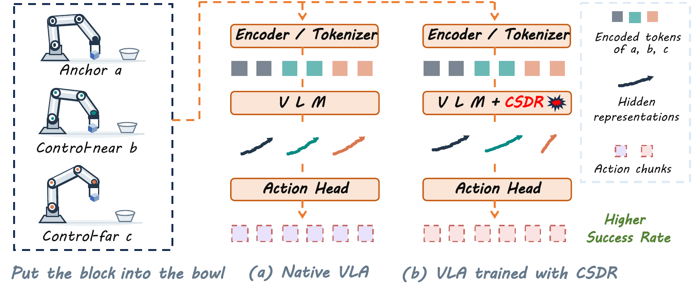

<div align="center">

# CSDR
### Control-Structured Dispersive Regularization for VLA Models

**Training-only representation regularization · Four baseline implementations · Unchanged inference architectures**



</div>

CSDR uses control information already available in robot demonstrations to optimize the hidden representations used for action prediction. Under the same instruction, windows with similar control requirements should have closer representations than windows with substantially different control requirements. Training combines a full-coverage prompt cohort plan with cross-GPU feature gathering, and refines these relationships through finite-margin ranking, action-error weighting, and confusion-based weighting. The method introduces no additional teacher, trainable projection head, or inference module.

---

## 1. Code Structure

```text
.
├── README.md                     # Environments, weights, usage, and Table 1 of the paper
├── csdr.py                       # prepare / train / pipeline / evaluate / infer
├── csdr_paths.py                  # Paths and subprocess environments
├── evaluate.py                   # Multi-GPU evaluation scheduling and aggregation
├── infer.py                      # Single-observation action inference via native model interfaces
├── spatial_eval_worker.py        # Native SpatialVLA SimplerEnv evaluation for one task
├── fetch_assets.py               # Download public simulation assets
├── config/paths.json             # Data, weights, environments, and output locations
├── assets/figure1.png            # Figure 1 of the paper
├── baselines/
│   ├── openvla_oft/{code,config,vendor}/
│   ├── turbovla/{code,config,vendor}/
│   ├── spatialvla/{code,vendor}/
│   └── starvla/{code,config,vendor}/
└── common/
    ├── cohort_planning/          # RLDS indexing, full-coverage plans, and window loading
    ├── dlimp/                    # SpatialVLA data dependency
    └── simpler/                 # Native SimplerEnv / ManiSkill2 code
```

`code/` contains the final continuation-training implementation, and `vendor/` contains the baseline runtime code it requires. Each baseline directory includes a `requirements.txt`. The four models retain their respective native action prediction and evaluation logic; incompatible action normalization schemes are not shared across models.

| Baseline | Training entry point | CSDR implementation | Evaluation entry point |
|---|---|---|---|
| OpenVLA-OFT | `baselines/openvla_oft/code/finetune.py` | `representation_losses.py` in the same directory | `vendor/scripts/eval_libero_single_task.py` |
| TurboVLA | `baselines/turbovla/code/train.py` | `csdr_loss_tail.py`, `representation_prefix.py` in the same directory | `code/evaluate.py` → native LIBERO rollout |
| SpatialVLA | `baselines/spatialvla/vendor/train/spatialvla_finetune.py` | `csdr_loss.py`, `monkey_patch.py` in the same directory | `spatial_eval_worker.py` → native SpatialVLA action adapter |
| StarVLA | `baselines/starvla/code/train_speed.py` | `csdr_loss_tail.py`, `training_model.py` in the same directory | `code/evaluate.py` → native policy server and SimplerEnv client |

The SpatialVLA RS-CL reproduction is isolated under
`baselines/spatialvla/rscl/`; it does not overwrite the CSDR training code.

### RS-CL reproduction on SpatialVLA

`baselines/spatialvla/rscl/` contains only the RS-CL reproduction entry points and
the auxiliary implementation needed by the existing SpatialVLA runtime. It uses
the same SpatialVLA backbone, Bridge training data, and native Bridge evaluation
protocol as the CSDR comparison.

Train from the project root with the SpatialVLA environment activated. First
prepare the Bridge cohort plans with `python csdr.py prepare spatialvla`
(Section 4.2). The command below reproduces the recorded RS-CL-inspired
training configuration; adjust the anonymous model, data, plan, and output
paths to your setup.

```bash
LAUNCHER=pytorch NCCL_P2P_LEVEL=NVL TORCH_NCCL_ASYNC_ERROR_HANDLING=1 \
CUDA_VISIBLE_DEVICES=0,1,2,3,4,5,6,7,8,9 \
OMP_NUM_THREADS=1 MKL_NUM_THREADS=1 OPENBLAS_NUM_THREADS=1 \
TOKENIZERS_PARALLELISM=true TF_CPP_MIN_LOG_LEVEL=2 \
WANDB_DISABLED=true WANDB_MODE=offline PYTHONUNBUFFERED=1 \
torchrun --standalone --nproc_per_node=10 \
  baselines/spatialvla/rscl/run_training_rscl.py \
  --model_name_or_path weights/spatialvla \
  --data_root_dir datasets/bridge \
  --data_mix bridge_oxe_csdr \
  --planned_cohort_data_dir runtime/plans/bridge \
  --planned_epoch_count 3 \
  --planned_episode_cache_size 16 \
  --planned_prefetch_size 64 \
  --planned_decode_workers 4 \
  --output_dir runtime/spatialvla_rscl \
  --do_train True --rscl True \
  --rscl_lambda 1.0 --rscl_beta 1.0 --rscl_temperature 0.2 \
  --rscl_projection_dim 128 --rscl_task_ratio 0.005 --rscl_warmup_steps 300 \
  --action_forward_steps 3 --obs_backward_steps 0 \
  --use_raw_dataloader True --dataloader_num_workers 0 \
  --per_device_train_batch_size 8 --gradient_accumulation_steps 4 \
  --max_steps 2542 \
  --learning_rate 5e-5 --lr_scheduler_type constant --warmup_steps 0 \
  --optim adamw_torch_fused --weight_decay 0 \
  --lora 32 --lora_alpha 32 --lora_target linear \
  --grad_checkpoint False --flash_attn True --bf16 True --tf32 True \
  --logging_steps 10 --save_strategy steps --save_steps 1000 \
  --save_total_limit 2 --save_safetensors True \
  --remove_unused_columns False --ddp_find_unused_parameters True \
  --report_to tensorboard --seed 42 --run_name RSCL-inspired
```

The effective batch size is 320, and the action window contains four steps.
The three indexed plans match the recorded setup, but `--max_steps 2542`
stops training after the first planned epoch. Checkpoints are saved every
1,000 updates and at the final update 2,542. The RS-CL-inspired auxiliary
budget uses a 300-step warm-up, a 0.5% task-loss ratio cap, and cosine decay.

Evaluate a completed or merged RS-CL checkpoint with the same multi-GPU
SpatialVLA evaluator used by the other Bridge experiments:

```bash
python baselines/spatialvla/rscl/evaluate_rscl.py \\
  --checkpoint runtime/spatialvla_rscl/merged \\
  --output runtime/spatialvla_rscl/evaluation \\
  --gpus 0,1,2,3,4,5,6,7,8,9
```

The RS-CL path adds the state-supervised summary and projection branch described
in the paper. The branch is used only during training; evaluation loads the
resulting SpatialVLA checkpoint through the native policy interface.

## 2. Environments

Training targets **Linux, 10 NVIDIA GPUs (48 GB per GPU in the experiments), and Python 3.10**. Install the NVIDIA driver, a CUDA toolkit compatible with PyTorch, `conda`, `git`, C/C++ build tools, and FFmpeg beforehand. Headless evaluation requires EGL / Vulkan support. Use separate environments to avoid conflicts between Transformers versions.

| Environment | PyTorch / torchvision | Transformers | Purpose |
|---|---|---|---|
| `openvla_oft` | 2.2.0 / 0.17.0 | OFT-customized 4.40.1, pinned commit | OFT training, inference, and LIBERO evaluation |
| `turbovla` | 2.2.0 / 0.17.0 | 4.56.2 | Turbo training, inference, and LIBERO evaluation |
| `spatialvla` | 2.2.0 / 0.17.0 | 4.47.0 | Spatial training and LoRA merging |
| `spatialvla_eval` | 2.7.1 / 0.22.1, CUDA 11.8 | 4.47.1 | Native Spatial SimplerEnv evaluation |
| `starvla` | 2.6.0 / 0.21.0 | 4.57.1 | Star training and inference server |
| `starvla_eval` | 2.7.1 / 0.22.1, CUDA 11.8 | The simulation client does not load a VLM | Native Star SimplerEnv client |

Use a separate Python 3.10 environment for each baseline and install its dependencies from the project root. For example, for SpatialVLA:

```bash
python3.10 -m venv envs/spatialvla
source envs/spatialvla/bin/activate
pip install -r baselines/spatialvla/requirements.txt
pip install --no-deps -e common/dlimp
pip install ninja packaging wheel 'setuptools<81'
pip install flash-attn==2.5.5 --no-build-isolation
```

For other models, replace `spatialvla` in the paths with the corresponding name. Only SpatialVLA requires the local installation of `common/dlimp`. StarVLA uses `flash-attn==2.7.4.post1`; the other training environments use `2.5.5`. Compile FlashAttention after installing PyTorch, and point `CUDA_HOME` to the matching CUDA toolkit. If a compatible environment already exists, simply configure its `bin/python` path.

SpatialVLA and StarVLA each use a separate environment for native SimplerEnv evaluation. Their dependencies are listed in `requirements_eval.txt` in the respective baseline directories. For example:

```bash
python3.10 -m venv envs/spatialvla_eval
source envs/spatialvla_eval/bin/activate
pip install -r baselines/spatialvla/requirements_eval.txt
pip install --no-deps -e common/simpler/ManiSkill2_real2sim -e common/simpler
```

Download simulation assets separately; large assets are not included in the code package:

```bash
python fetch_assets.py libero
python fetch_assets.py simpler
```

LIBERO is pinned to `3fc9044a3d16c5142ea449c617af656d820fec85`; the ManiSkill2 assets for Simpler are pinned to `cd45dd27dc6bb26d048cb6570cdab4e3f935cc37`. LIBERO initial states and BDDL files are provided in the public repository; the RLDS training data must be prepared separately. If simulation assets are already available, specify the LIBERO path in the configuration and place Simpler's `data/` and `mani_skill2_real2sim/assets/` in their corresponding directories.

## 3. Initial Weights and Data

### 3.1 Hugging Face Weights

| Baseline | Initial weights | Default local directory |
|---|---|---|
| OpenVLA-OFT | [moojink/openvla-7b-oft-finetuned-libero-spatial-object-goal-10](https://huggingface.co/moojink/openvla-7b-oft-finetuned-libero-spatial-object-goal-10) | `weights/openvla_oft/` |
| TurboVLA | [H-EmbodVis/TurboVLA](https://huggingface.co/H-EmbodVis/TurboVLA) | `weights/turbovla/`, using `checkpoints/libero/turbovla_libero.pth` |
| SpatialVLA | [IPEC-COMMUNITY/spatialvla-4b-224-pt](https://huggingface.co/IPEC-COMMUNITY/spatialvla-4b-224-pt) | `weights/spatialvla/` |
| StarVLA | [StarVLA/Qwen-GR00T-Bridge](https://huggingface.co/StarVLA/Qwen-GR00T-Bridge) | `weights/starvla/`, using `checkpoints/steps_45000_pytorch_model.pt` |

StarVLA uses the **Qwen2.5-VL-3B, QwenGR00T, Bridge-only 45,000-step** checkpoint. It also requires [StarVLA/Qwen2.5-VL-3B-Instruct-Action](https://huggingface.co/StarVLA/Qwen2.5-VL-3B-Instruct-Action), placed in `weights/Qwen2.5-VL-3B-Instruct-Action/` by default.

TurboVLA also requires [DINOv3 ViT-B/16](https://huggingface.co/facebook/dinov3-vitb16-pretrain-lvd1689m) and [BERT base uncased](https://huggingface.co/google-bert/bert-base-uncased), placed in `weights/dinov3/` and `weights/bert/`, respectively. Access to DINOv3 must first be granted through its model page.

Download the entire model repository, retaining the configuration, processor, tokenizer, normalization statistics, and custom model files. OFT also requires the action head and proprioceptive state projector. Do not download only the backbone weights.

Use the Hugging Face download tool directly on the training server, for example:

```bash
hf download moojink/openvla-7b-oft-finetuned-libero-spatial-object-goal-10 --local-dir weights/openvla_oft
hf download H-EmbodVis/TurboVLA --local-dir weights/turbovla
hf download IPEC-COMMUNITY/spatialvla-4b-224-pt --local-dir weights/spatialvla
hf download StarVLA/Qwen-GR00T-Bridge --local-dir weights/starvla
hf download StarVLA/Qwen2.5-VL-3B-Instruct-Action --local-dir weights/Qwen2.5-VL-3B-Instruct-Action
hf download facebook/dinov3-vitb16-pretrain-lvd1689m --local-dir weights/dinov3
hf download google-bert/bert-base-uncased --local-dir weights/bert
```

`hf` is provided by `huggingface_hub`. These commands can run in any environment where the tool is installed.

### 3.2 Data Directories

```text
datasets/
├── modified_libero_rlds/
│   ├── libero_spatial_no_noops/1.0.0/
│   ├── libero_object_no_noops/1.0.0/
│   ├── libero_goal_no_noops/1.0.0/
│   └── libero_10_no_noops/1.0.0/
├── bridge/
│   └── bridge_oxe/0.1.0/                 # RLDS data used by SpatialVLA
└── bridge_orig_1.0.0_lerobot/            # Public LeRobot data used by StarVLA
    ├── meta/
    ├── data/
    └── videos/
```

StarVLA uses [IPEC-COMMUNITY/bridge_orig_lerobot](https://huggingface.co/datasets/IPEC-COMMUNITY/bridge_orig_lerobot) at revision `0e9d76d07e9df3ea3eba257b2520d4913833fad2`. SpatialVLA and StarVLA differ in their Bridge data formats, window counts, and preprocessing; their data directories are not interchangeable.

### 3.3 Path Configuration

Edit `config/paths.json`, or create a private configuration copy:

```bash
cp config/paths.json config/paths.local.json
export CSDR_PATHS="$PWD/config/paths.local.json"
```

All relative paths are resolved from the project root. `work_dir` specifies where preprocessing caches, checkpoints, and evaluation results are stored, and should point to a disk with sufficient space. The code contains no absolute paths from the authors' machines. Do not upload private configuration files or generated outputs to an anonymous repository.

## 4. Data Preparation and Training

### 4.1 Final Training Configurations

| Baseline | Micro-batch per GPU | GPUs | Gradient accumulation | Effective batch size | Continuation budget | Checkpoint interval |
|---|---:|---:|---:|---:|---:|---|
| OpenVLA-OFT | 4 | 10 | 3 | 120 | 3 epochs, 6,543 steps | Every 2,181 steps |
| TurboVLA | 4 | 10 | 3 | 120 | 3 epochs, 6,837 steps | Every 2,279 steps |
| SpatialVLA | 8 | 10 | 4 | 320 | 3 epochs, 7,626 steps | Every 2,542 steps |
| StarVLA | 2 | 10 | 8 | 160 | 1 epoch, 11,832 steps | 2,958 / 5,916 / 8,874 / 11,832 |

A step denotes an optimizer update; an epoch denotes one complete pass over the corresponding predefined real training windows. The final batch uses validity masks, so its actual sample count may be smaller than the usual effective batch size. The default plans target 10 GPUs; changing only the GPU count in `torchrun` is not sufficient.

OFT uses fixed 8-step windows, and SpatialVLA uses 4-step windows. StarVLA's 16-step action chunks and TurboVLA's 12-step action chunks retain trajectory-end windows and construct CSDR relationships using the common valid real prefix of each triplet, with a minimum valid length of 4. Each model retains its native task loss and action normalization.

| Baseline | Optimization settings | Retained runtime optimizations |
|---|---|---|
| OpenVLA-OFT | LoRA rank 32, LR 5e-5 | Cross-GPU relationship computation and precomputed full-coverage plans |
| TurboVLA | AdamW, LR 1e-5, cosine schedule after a 300-step warmup | Raw image/action caches, enabled after validation; native input transformations remain unchanged |
| SpatialVLA | LoRA rank/alpha 32, fused AdamW, constant LR 5e-5 | Multithreaded trajectory decoding, prefetching, FlashAttention, and BF16 |
| StarVLA | Backbone LR 1e-6, action-head LR 1e-5; FP32 master AdamW | Fixed frame caches, prefetching, optimizer sharding, and disabled activation recomputation |

All four models cap the regularization-to-task-loss ratio at 0.5%, use a 300-step regularization warmup, and do not apply an additional decay to zero in the final phase. StarVLA's `no_checkpoint` means that activation checkpointing is disabled; it **does not disable saving model weights or training states**.

### 4.2 Preparing Training Windows

```bash
python csdr.py prepare openvla_oft
python csdr.py prepare turbovla
python csdr.py prepare spatialvla
python csdr.py prepare starvla
```

These commands build indices, full-coverage cohort plans, and the caches required by each model. TurboVLA also checks consistency between cached and original data processing; cached training is not enabled if validation fails. StarVLA decodes the dataset videos, so allow additional preparation time and cache storage. These fixed resources do not need to be regenerated during training.

### 4.3 Continuation Training and Automatic Evaluation

First use `--dry-run` to inspect the resolved paths and commands:

```bash
python csdr.py train openvla_oft --dry-run
```

Launch each model separately. **Do not run the following four 10-GPU training commands simultaneously**:

```bash
python csdr.py pipeline openvla_oft
python csdr.py pipeline turbovla
python csdr.py pipeline spatialvla
python csdr.py pipeline starvla
```

`pipeline` runs training first, then evaluates each checkpoint saved during that run in sequence using multiple GPUs after training completes successfully. For training only, replace `pipeline` with `train`. W&B is disabled by default; metrics and outputs are saved under `work_dir`.

To keep the process running after disconnecting SSH, use `tmux`:

```bash
tmux new -s csdr
python csdr.py pipeline starvla
# Press Ctrl-b, then d to detach; reconnect with tmux attach -t csdr
```

To resume interrupted training, provide a complete checkpoint directory and retain the same plan and total training budget:

```bash
python csdr.py pipeline starvla --resume runtime/starvla/train/step_002958
python csdr.py pipeline turbovla --resume runtime/turbovla/train/step_002279
python csdr.py pipeline spatialvla --resume runtime/spatialvla/checkpoints/checkpoint-2542
python csdr.py pipeline openvla_oft --resume runtime/openvla_oft/checkpoints/csdr--302181_chkpt
```

Resuming requires the optimizer, scheduler, and corresponding random-state files. OFT checkpoint numbers include the initial 300,000-step offset; the other directory names record the number of additional updates.

## 5. Evaluation and Inference

### 5.1 Closed-Loop Evaluation

Omit `--checkpoint` to evaluate the initial weights specified in the configuration, or provide it to evaluate a continuation checkpoint. For example:

```bash
python csdr.py evaluate openvla_oft
python csdr.py evaluate spatialvla
python csdr.py evaluate turbovla --checkpoint runtime/turbovla/train/step_006837/turbovla_csdr_step_6837.pth
python csdr.py evaluate starvla --checkpoint runtime/starvla/train/step_011832/checkpoints/steps_56832_pytorch_model.pt
```

SpatialVLA LoRA checkpoints are first merged into a separate `runtime/spatialvla/merged/` directory before being passed to the native inference interface. The initial weights are not overwritten.

| Model | Tasks and trials | Native action execution settings | Parallelization |
|---|---|---|---|
| OpenVLA-OFT | LIBERO: 4 suites × 10 tasks × 50 trials = 2,000 | Seed 7; 8-step open loop | 10 independent task workers |
| TurboVLA | Same LIBERO setup, 2,000 trials in total | Seed 7; BF16; 12-step open loop | 10 independent task workers |
| SpatialVLA | WidowX: 4 tasks × 24 episodes × 4 seeds = 384 | Native action ensembling with parameter -0.8; 60 steps for the first three tasks and 120 for eggplant; 5 Hz | Task/seed combinations distributed across GPUs |
| StarVLA | WidowX: 4 tasks × 24 episodes × 4 seeds = 384 | Native policy server and action ensembling; 120 steps per task; 5 Hz | Task/seed partitioning with paired servers and environments |

Bridge evaluation uses seeds 7, 8, 9, and 10, with a simulation frequency of 500 Hz. Parallel scheduling does not change task initial states, action prediction, or environment time limits. Compare the two weight versions of each model under the same configuration. Results are written to `runtime/<model>/eval/`, with aggregated results in `summary.json`.

### 5.2 Single-Observation Action Inference

The following entry points call the original models' action prediction interfaces and output JSON. They **do not connect to or control a physical robot**:

```bash
# Single-camera Bridge models
python csdr.py infer spatialvla --image examples_input/image.png --instruction "put the carrot on the plate" --output actions.json
python csdr.py infer starvla --image examples_input/image.png --instruction "put the carrot on the plate" --output actions.json

# LIBERO models require a primary camera, a wrist camera, and an 8D proprioceptive state
python csdr.py infer openvla_oft --image examples_input/image.png --wrist examples_input/wrist.png --state examples_input/state.json --instruction "put the block into the bowl" --suite libero_spatial --output actions.json
python csdr.py infer turbovla --image examples_input/image.png --wrist examples_input/wrist.png --state examples_input/state.json --instruction "put the block into the bowl" --output actions.json
```

`examples_input/` denotes user-provided inputs, not data included with the project. For LIBERO, `state.json` is an array of 8 values: 3D position, 3D axis-angle orientation, and two gripper joint positions. Input image orientation should match the flipped camera images used by the native LIBERO evaluator. SpatialVLA returns a native single-step environment action, while StarVLA returns an unnormalized action chunk. For continuous closed-loop execution, use the full evaluators above to retain action ensembling and temporal state.

Single-observation inference also supports `--checkpoint`. SpatialVLA LoRA directories are merged first; StarVLA accepts either a `.pt` file or a complete continuation checkpoint directory containing `complete.json`.


## 6. Experimental Results

### LIBERO

| Method | Spatial | Object | Goal | Long | Average |
|---|---:|---:|---:|---:|---:|
| OpenVLA-OFT | 93.60 | 99.20 | 96.80 | 94.60 | 96.05 |
| **OpenVLA-OFT + CSDR** | **94.40** | **99.40** | **98.20** | **95.40** | **96.85** |
| TurboVLA | 92.00 | 98.60 | 96.20 | 94.60 | 95.35 |
| **TurboVLA + CSDR** | **92.20** | **99.00** | **97.00** | **95.20** | **95.85** |

### BridgeData V2 → SimplerEnv WidowX

| Method | Spoon on towel | Carrot on plate | Stack blocks | Eggplant in basket | Average |
|---|---:|---:|---:|---:|---:|
| SpatialVLA | 20.83 | 16.67 | 20.83 | 95.83 | 38.54 |
| **SpatialVLA + CSDR** | **41.67** | **37.50** | **50.00** | **96.88** | **56.51** |
| StarVLA | 91.67 | 51.04 | 43.75 | 88.54 | 68.75 |
| **StarVLA + CSDR** | **93.75** | **58.33** | **45.83** | **92.71** | **72.66** |
